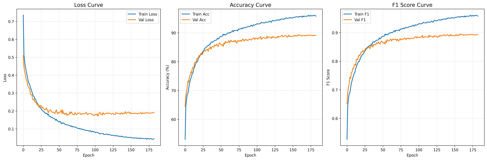
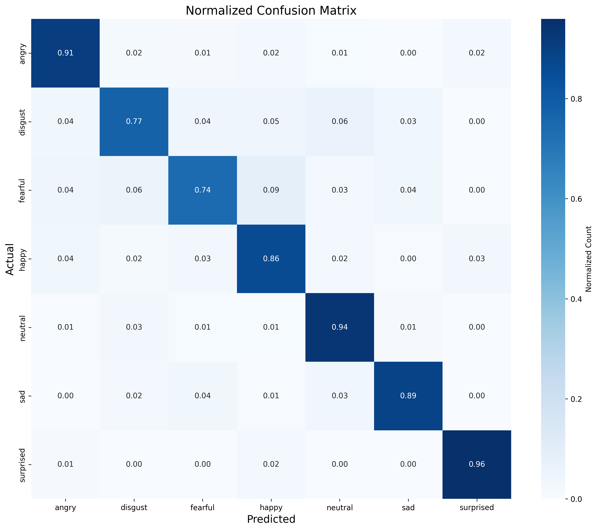
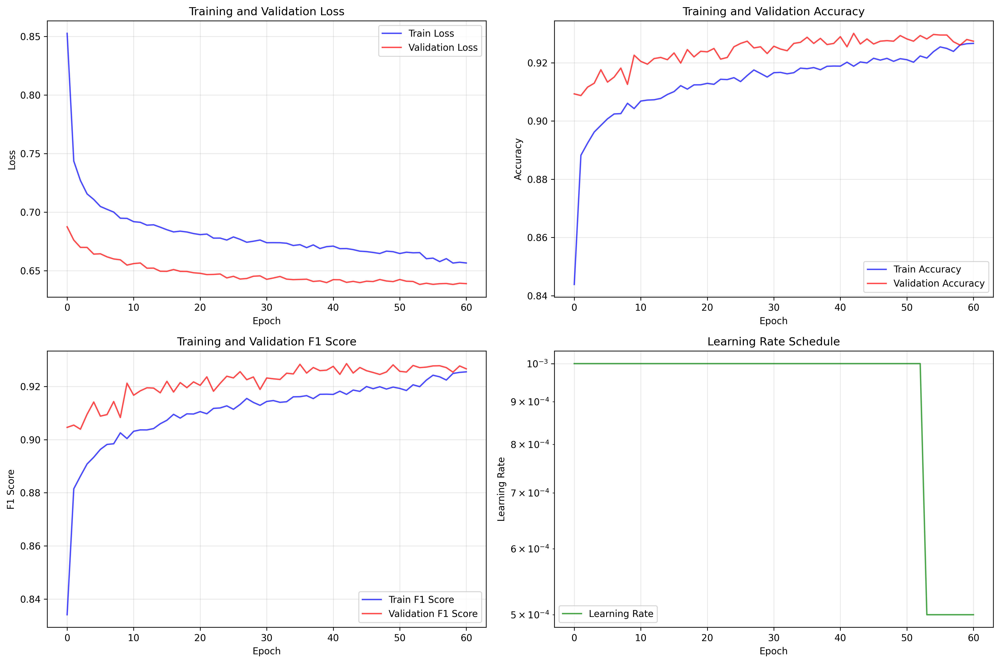

<div align="center">

<!-- HEADER BANNER -->


<br/>

<!-- BADGES -->
[](https://python.org)
[](https://pytorch.org)
[]()
[]()
[]()
[](LICENSE)

<br/>

**End-to-end speech emotion recognition system trained on 8 public datasets, capable of classifying 7 emotions with real-time microphone inference.**

[📖 Overview](#-overview) · [📊 Results](#-results) · [🗂 Datasets](#-datasets-used) · [⚙️ Installation](#️-installation) · [🚀 Usage](#-usage) · [🏗 Architecture](#-model--architecture)

</div>

---

## 📖 Overview

This project implements a complete **Speech Emotion Recognition (SER)** pipeline — from raw audio ingestion to live microphone prediction. It merges 8 heterogeneous public datasets into a single training workflow, extracts 367 handcrafted acoustic features, and trains a deep learning model using PyTorch to classify human speech into **7 emotion categories**.

> Built to demonstrate practical ML engineering: dataset wrangling, feature engineering, class imbalance handling, evaluation, and deployment-style real-time inference — all in one repository.

```
Raw Audio → Feature Extraction (367 features) → Deep Neural Network → Emotion Label
                                                         ↑
                                          8 Datasets · 51,077 Samples
```

---

## ✨ Key Highlights

| 🔧 Engineering | 📈 Performance | 🎯 Deployment |
|---|---|---|
| 8 datasets merged into 1 pipeline | **89.33%** test accuracy | Real-time mic inference |
| 367 acoustic features extracted | **0.895** weighted F1-score | Smoothed live predictions |
| Focal loss + weighted sampling | 0.896 best validation F1 | Model checkpointing |
| Warmup-cosine LR schedule | 51,077 training samples | Label encoder + scaler saved |
| Gradient clipping | 7,650 test samples | Portable model artifacts |

---

## 🗂 Datasets Used

The preprocessing pipeline unifies 8 public emotional speech datasets into a single label space:

| Dataset | Description |
|---|---|
| **CREMA-D** | Crowd-sourced Emotional Multimodal Actors Dataset |
| **EmoDB** | Berlin Database of Emotional Speech (German) |
| **ESD** | Emotional Speech Dataset (Mandarin + English) |
| **IEMOCAP** | Interactive Emotional Dyadic Motion Capture |
| **MELD** | Multimodal EmotionLines Dataset (Friends TV) |
| **RAVDESS** | Ryerson Audio-Visual Database of Emotional Speech |
| **SAVEE** | Surrey Audio-Visual Expressed Emotion |
| **TESS** | Toronto Emotional Speech Set |

> ⚠️ Raw dataset files are **not included** in this repository. Download each dataset from their official sources and place them in `data_raw/`.

---

## 🎭 Emotion Classes

After label normalization and filtering of low-frequency classes, the model predicts **7 emotions**:

<div align="center">

| 😠 Angry | 🤢 Disgust | 😨 Fearful | 😄 Happy | 😐 Neutral | 😢 Sad | 😲 Surprised |
|:---:|:---:|:---:|:---:|:---:|:---:|:---:|
| 1,446 | 384 | 388 | 1,438 | 1,449 | 1,437 | 1,108 |

*Support counts from the held-out test set*

</div>

---

## 📊 Results

### Overall Performance

| Metric | Value |
|---|---|
| 🗂 Dataset size | 51,077 samples |
| 🔢 Feature count | 367 |
| ✅ Test Accuracy | **89.33%** |
| 📐 Test F1-score (weighted) | **0.895** |
| 🏆 Best Validation F1 | **0.896** |
| 🧪 Test set size | 7,650 samples |

---

### Class-wise Performance

| Emotion | Precision | Recall | F1-score | Support |
|---|:---:|:---:|:---:|:---:|
| 😠 Angry | 0.92 | 0.91 | **0.92** | 1,446 |
| 🤢 Disgust | 0.67 | 0.77 | **0.72** | 384 |
| 😨 Fearful | 0.65 | 0.74 | **0.69** | 388 |
| 😄 Happy | 0.90 | 0.86 | **0.88** | 1,438 |
| 😐 Neutral | 0.91 | 0.94 | **0.92** | 1,449 |
| 😢 Sad | 0.96 | 0.89 | **0.92** | 1,437 |
| 😲 Surprised | 0.93 | 0.96 | **0.94** | 1,108 |

---

### Visual Outputs

#### 📉 Training Curves
> Loss and accuracy curves across training epochs.



#### 🔲 Confusion Matrix
> Normalized confusion matrix on the held-out test set.



#### 📋 Training Metrics Summary
> Epoch-level summary of key training metrics.



---

## 🏗 Model & Architecture

### Feature Extraction (367 features)

```
Audio Signal
    ├── MFCCs (mean + std + delta + delta-delta)
    ├── Spectral Features  →  centroid, bandwidth, rolloff, contrast
    ├── Chroma Features    →  chroma STFT, chroma CQT
    ├── Mel-Spectrogram    →  mel filterbank statistics
    ├── Tempo & Rhythm     →  BPM, beat strength
    └── Zero-Crossing Rate, RMS Energy, Tonnetz
```

### Training Pipeline Techniques

```
Training Tricks Applied
    ├── ⚖️  Weighted Random Sampler       → handles class imbalance
    ├── 🔥  Focal Loss                    → focuses on hard examples
    ├── 📈  Warmup + Cosine LR Schedule   → stable convergence
    ├── ✂️  Gradient Clipping             → prevents exploding gradients
    ├── 💾  Model Checkpointing           → saves best validation F1
    └── 📏  StandardScaler               → feature normalization
```

---

## 🗃 Project Structure

```
multidataset-speech-emotion-recognition/
│
├── 📁 src/
│   ├── preprocess_dataset.py     # Audio scanning, WAV conversion, feature extraction
│   ├── train_model.py            # Model definition, training loop, evaluation
│   └── realtime_inference.py     # Live mic capture + smoothed prediction
│
├── 📁 results/
│   ├── confusion_matrix.jpg      # Normalized test confusion matrix
│   ├── training_curves.jpg       # Loss & accuracy plots
│   ├── training_metrics_summary.jpg
│   └── classification_report.csv
│
├── 📁 docs/
│   ├── training_log_summary.pdf
│   └── training_console_output.pdf
│
├── README.md
├── requirements.txt
├── .gitignore
└── LICENSE
```

---

## ⚙️ Installation

### Prerequisites
- Python 3.9+
- CUDA-compatible GPU (recommended) or CPU
- PortAudio (required for PyAudio / real-time inference)

```bash
# 1. Clone the repository
git clone https://github.com/your-username/multidataset-speech-emotion-recognition.git
cd multidataset-speech-emotion-recognition

# 2. (Optional) Create a virtual environment
python -m venv venv
source venv/bin/activate        # Linux / macOS
venv\Scripts\activate           # Windows

# 3. Install dependencies
pip install -r requirements.txt
```

---

## 🚀 Usage

### Step 1 — Preprocess Datasets

Place your downloaded datasets inside `data_raw/`, then run:

```bash
python src/preprocess_dataset.py \
    --mode both \
    --input-dir data_raw \
    --output-dir data_converted_wav
```

This will:
- Scan all dataset folders recursively
- Convert non-WAV formats to WAV
- Extract 367 acoustic features per sample
- Save a unified `features.csv` for training

---

### Step 2 — Train the Model

```bash
python src/train_model.py
```

This will:
- Load and normalize features from `features.csv`
- Apply label encoding and rare-class filtering
- Train/val/test split and feature scaling
- Train the model with all regularization techniques
- Save the best checkpoint, scaler, and label encoder
- Output training curves, confusion matrix, and classification report

---

### Step 3 — Real-Time Inference

```bash
python src/realtime_inference.py
```

This will:
- Load the saved model, scaler, and label encoder
- Capture live audio from your default microphone
- Extract features on-the-fly
- Output smoothed emotion predictions in real time

---

## 🛠 Tech Stack

<div align="center">

[](https://python.org)
[](https://pytorch.org)
[](https://numpy.org)
[](https://pandas.pydata.org)
[](https://scikit-learn.org)
[](https://librosa.org)
[](https://matplotlib.org)
[](https://seaborn.pydata.org)

</div>

---

## 🧩 Challenges & Solutions

| Challenge | Solution Applied |
|---|---|
| 8 datasets with inconsistent label schemes | Unified label mapping with preprocessing normalization |
| Multiple audio formats (mp4, flv, wav) | Automated WAV conversion in preprocessing pipeline |
| Severe class imbalance across emotions | Weighted Random Sampler + Focal Loss |
| Unstable live predictions | Smoothing over a rolling window of recent outputs |
| Overfitting on small classes | Rare-class filtering + gradient clipping + LR warmup |

---

## 🔭 Future Improvements

- [ ] Add a **Streamlit** or desktop GUI demo for easy interaction
- [ ] Export model as a **REST API** (FastAPI / Flask)
- [ ] Speaker-independent cross-validation experiments
- [ ] Explore **CNN, CRNN, or transformer** audio representations (wav2vec 2.0, HuBERT)
- [ ] Package inference into a **lightweight deployable app**
- [ ] Add **Docker** support for reproducible environments

---

<div align="center">


*If you found this useful, please consider giving it a ⭐*

</div># multidataset-speech-emotion-recognition
